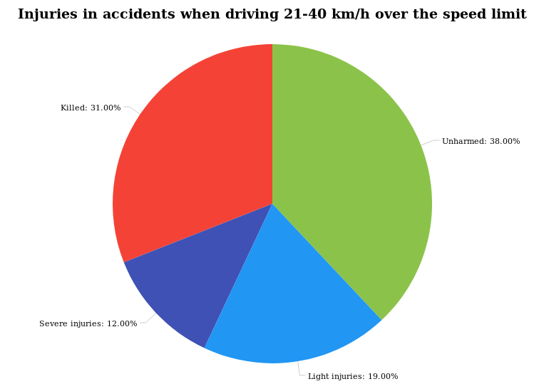
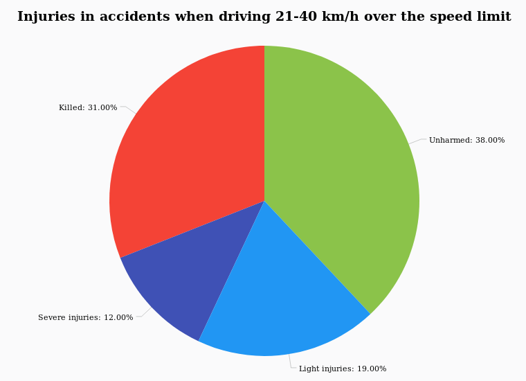

# Introduction
In this chapter, the aspects of speeding will be introduced. This is to achieve a better understanding of how big of a factor speeding is, and to help determine whether or not this is a relevant point of attention.

## Is Speed Really a Concern?

When it comes to traffic safety there are a lot of factors that affect every single accident. In 2017, 1.756 people were seriously injured in a road accident, and 175 people lost their life in Denmark[^VD_Trafikulykker_for_året_2017].  
To better understand how speed affects traffic accidents, the Council for Safe Traffic composed some statistics based on data published by The Norwegian Public Roads Administration. These statistics show a correlation between speed and fatalities in accidents[^CFST_Statistics].

| Speed     | Frontal Collision                     | Pedestrian Crossing                           |
| -----     | -----------------                     | -------------------                           |
| 80 km/h   | In 3 out of 10 accidents someone dies | In 6 out of 10 accidents a pedestrian dies.   |
| 90 km/h   | In 6 out of 10 accidents someone dies | In 8 out of 10 accidents a pedestrian dies.   |
| 100 km/h  | In 8 out of 10 accidents someone dies | In 9 out of 10 accidents a pedestrian dies.   |

Likewise, a report from The Danish Road Directorate[^DRD_fatal_accidents] shows that in 2010 52% of the accidents, where the driver drove more than 20 km/h above the speed limit, resulted in a fatal accident, and only 6% escaped without any injuries. In cases where the driver complies with the speed limit, 31% of accidents were fatal, and 37% were completely unharmed. Furthermore, the numbers reveal that the speeding limit was exceeded in 59% of all fatal accidents.

**These should be placed side by side. Caption: "Graphs showing injuries when you obey the speed limit compared to when you exceed it."**

Now that it has been established that speed actually is a relevant factor in traffic accidents, the following initial problem statement is formed:

> *What is done today to assist drivers in driving more safely, in order to reduce the amount and severity of traffic accidents?*

[^DRD_fatal_accidents]: The Danish Road Directorate - fatal accidents and speed - http://www.vejdirektoratet.dk/DA/viden_og_data/publikationer/Lists/Publikationer/Attachments/508/hastigheder%20ved%20d%C3%B8dsulykker.pdf

[^CFST_Statistics]: The Council For Safe Traffic - Statistic - https://www.sikkertrafik.dk/presse/statistik/adfaerd/fart

<!--[^HVU_hvorfor_sker_ulykker]: The Danish Road Traffic Accident Investigation Board: Hvorfor sker trafikulykkerne? from http://www.hvu.dk/SiteCollectionDocuments/PDFx_HVUdec14_HvorforSkerUlykkerne.pdf -->

<!--[^HVU_Risikovillig_kørsel]: The Danish Road Traffic Accident Investigation Board: Risikovillig kørsel from http://www.hvu.dk/SiteCollectionDocuments/Havarikommissionen2018_RisikovilligK%C3%B8rsel.pdf -->

<!--[^HVU_Grove_Hastighedsovertrædelser]: The Danish Road Traffic Accident Investigation Board: Grove Hastighedsovertrædelser from: http://www.hvu.dk/SiteCollectionDocuments/HVUrapp08_Hastighed.pdf -->

[^VD_Trafikulykker_for_året_2017]: Vejdirektoratet: Trafikulykker for året 2017 from http://www.vejdirektoratet.dk/DA/viden_og_data/publikationer/Lists/Publikationer/Attachments/979/Trafikulykker%20for%20%C3%A5ret%202017%20-%20web.pdf

## Current Systems
In this section, some of the current solutions used by car manufacturers to increase traffic safety are presented. The section will only investigate what manufacturers are doing for problems derived from the initial problem, as the report will focus on a technological approach to reduce and solve the problem.

Safety seems to be highly regarded by car manufacturers. Extensive testing is done in order to make sure that users of cars can feel as safe as possible while driving. Many car manufacturers are working on automating the different aspects of driving to make them more safe, and more convenient. This amount of automation is described in a taxonomy called "The Five Levels of Automation". [^sae_5_level]
Where level 0 describes a car with no automation, and level 5 describes a completely autonomous car. Many of the major car manufactures, like BMW [^bmw], Mercedes[^mercedes], and Hyundai [^hyundai], work with this scale.

An example  of such automation is made by Hyundai. They use ultrasonic and radar sensors to cover blind spots in the car. The car will then alert the driver if other vehicles is approaching or has entered the blind spot. The system will also prevent the driver from either leaving his/her lane, or break, if it has detected a vehicle in the blind spot[^hyundai_blind_spot].

In 2008 Marcin L. Eichner et. al. published a paper[^eichner08] on how to recognize round speed limit signs with a neural network. The algorithm would use the red channel of an image to detect speed signs. Then crop the image to only contain the speed sign, and then feed it to a neural network, which will then classify the speed sign.
Since then such algorithms have been integrated in many cars. Manufacturers such as BMW, Ford, and Audi have integrated traffic sign recognition in their cars with disparate actions[^bmwRec] [^fordRec] [^audiRec]. The technology is used to notify the driver of the current speed limit in case the driver missed the sign. In some cases cars even adjust the speed of the car to the current speed limit in an adaptive-cruise-control matter.

[^eichner08]:http://breckon.eu/toby/publications/papers/eichner08speedlimit_a.pdf

[^fordRec]: https://www.ford.co.uk/shop/research/technology/driving-experience/traffic-sign-recognition-system

[^audiRec]: https://www.audi-mediacenter.com/en/technology-lexicon-7180/driver-assistance-systems-7184

[^bmwRec]: http://www.adelaidebmw.com.au/com/en/newvehicles/3series/sedan_active_hybrid/2011/showroom/safety/traffic_sign_recognition1.html

<!-- [^vejdirektoratet]: http://www.vejdirektoratet.dk/DA/om-os/nyheder-og-presse/nyheder/Sider/F%C3%A6rre-dr%C3%A6bte-i-trafikken-i-2017---men-fortsat-for-mange.aspx -->

<!--[^marketresearch]: https://blog.marketresearch.com/artificial-intelligence-in-cars-what-to-expect-from-2017-to-2021-->

[^sae_5_level]: https://www.sae.org/binaries/content/assets/cm/content/news/press-releases/pathway-to-autonomy/automated_driving.pdf

[^bmw]: https://www.bmw.com/en/automotive-life/autonomous-driving.html

[^mercedes]: https://www.mercedes-benz.com/en/mercedes-benz/next/automation/mapping-the-way-to-autonomous-driving/

[^hyundai]: https://www.hyundai.news/eu/technology/how-do-self-driving-cars-work/

[^hyundai_blind_spot]: https://www.hyundai.news/eu/technology/another-set-of-eyes-how-does-blind-spot-detection-work/
